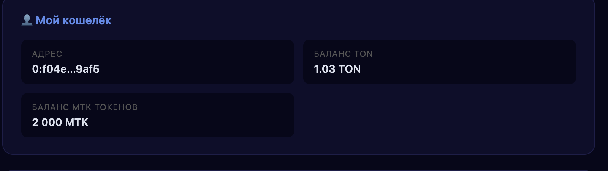
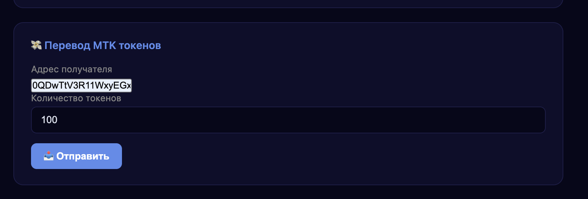
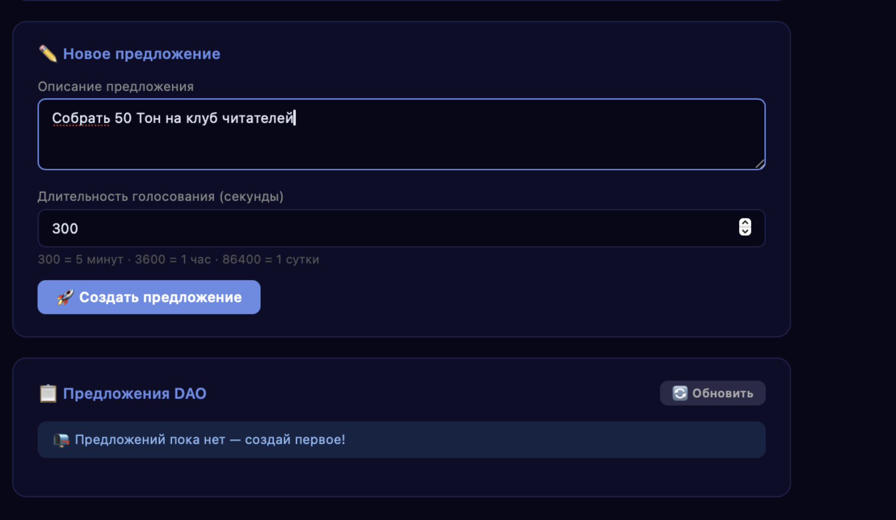
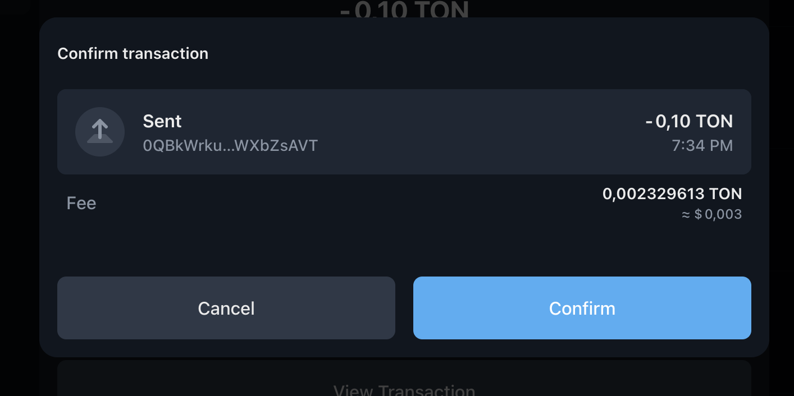
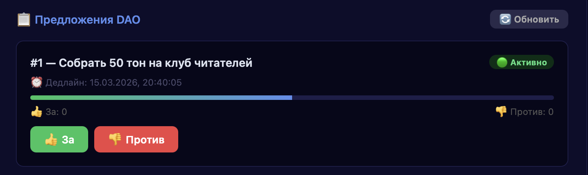
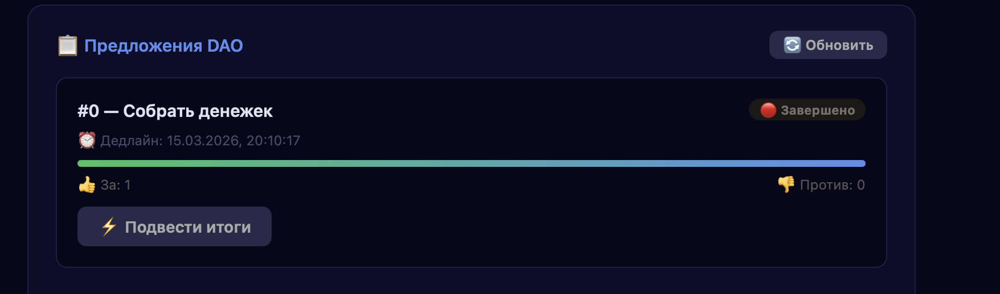
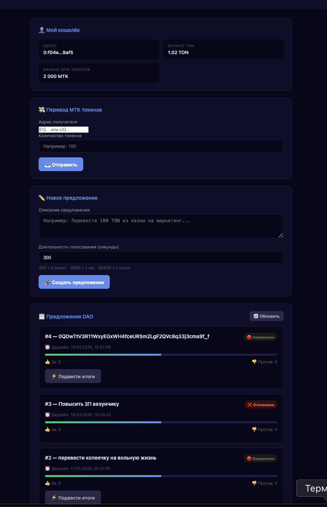

# fp-dao
# 

## 👩‍🎓 Состав группы:
Бровкина София M3402 0QDwTtV3R11WxyEGxWH4fceUR5m2LgF2QVc8q33j3cma9f_f
Полишкарова Анна M3403 0QB1xpnHxQQnl24-r3hb1-J_zP-8dKV3r3Bb8ccYW4WkNlOp 
Дудина Вероника M3401 0QD1vNr3xwMoTAbv2i49rf7aApHnXKx2UMKWLNY6cjkz7RWy  

## 💻 Платформа
ton testnet

## 📝 Краткое описание выполненных шагов
1. Проверка отображения баланса и отпрвавления токенов
 
 

2. Написали и задеплоили контракт
 https://testnet.tonscan.org/address/kQB8pvb2Q08Pi3u_KStelwaXTzdBKhk2WWdCYVjzA88HlKfZ

3. Создали index.html
   
   
   
   
   

## Ссылку на ваши верифицированные контракты в обозревателе сети

https://testnet.tonscan.org/address/kQDQqFZT54XGa6mSP1tRKqffrie_5h06n9XL14CF4-s4xcho
## Ссылку на задеплоенное приложение
https://sophia199768.github.io/fp-dao/

